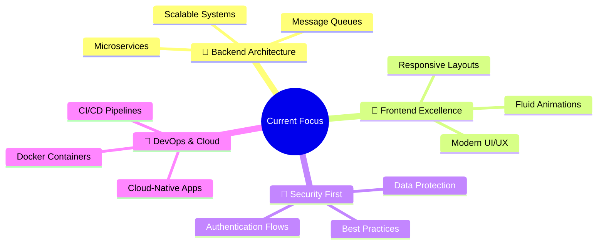

# 👋 Hey there! I'm Husnain

**Full Stack Developer (MERN) from Pakistan 🇵🇰**

*Building scalable, secure, and user-centric applications with a passion for solving complex problems, designing efficient backend systems, and crafting engaging frontend experiences that bring ideas to life.*

---

## 🔧 Tech Stack

### 💻 Languages

### 🧰 Frameworks & Libraries

**Frontend:**

**Backend:**

### 🗄️ Databases

### 📦 Messaging & Queues

### 🛠️ Tools & Platforms

### ⚙️ Architecture

---

## 🚀 What I Do

| 🖥️ **Dynamic Web Apps** | 🔐 **Secure Backend Systems** | 📡 **Real-time Communication** |
|:---:|:---:|:---:|
| Smooth UIs and real-time interactions that engage users | Designed for scale and performance with robust architecture | Platforms powered by sockets and message queues |

| 🤖 **AI-Integrated Applications** | ☁️ **Cloud-Deployed Services** |
|:---:|:---:|
| Computer vision and automation solutions | Using Docker and CI/CD workflows for seamless deployment |

> *At the core, I enjoy building end-to-end solutions that are not only functional but also **impactful**, **adaptable**, and **future-ready**.*

---

## 📈 Current Focus

- 🧱 **Architecting scalable backend systems** using microservices & queues
- 🎨 **Elevating UI/UX** with responsive layouts and fluid animations
- 🔐 **Implementing strong security practices** in modern auth flows
- 🐳 **Expanding expertise in Docker**, DevOps, and cloud-native environments

---

## 📊 GitHub Stats

---

## 🏆 GitHub Trophies

---

## 🌟 Featured Projects

---

## 📬 Let's Connect

**Always open to collaborating on challenging projects, innovative ideas, or impactful solutions.**

---

### ✨ *Let's create something extraordinary together!* ✨

---

**💡 "Code is like humor. When you have to explain it, it's bad."** – Cory House

